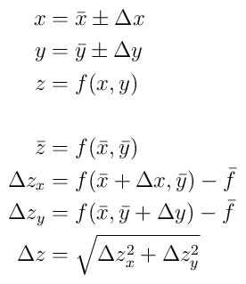

# pyErrorProp

`pyErrorProp` is a python module that performs various calculations with
uncertain quantities, including error propagation.  The module uses `pint` to
provide full support for physical quantities and provides a few benefits over `pint`'s
`Measurement` class.

## Examples

Let's say you wanted to measure the acceleration of gravity from a set of measurements you took by
dropping a ball bearing from 1.5 meters and timing how long it took to hit the floor.
You might writing the following script.
```python
#! /usr/bin/env python

from pyErrorProp import *

# we first need to setup an uncertainty convention, which then defines
# in class for uncertain quantities. the uncertain quantity is based
# on a pint Quantity class.
conv = UncertaintyConvention()
UQ_ = conv.UncertainQuantity
Q_ = UQ_.Quantity


# RAW DATA
# Q_ is an alias for pint.Quantity, it creates a quantity with units.
TimeData = Q_([ 0.431
              , 0.603
              , 0.504
              , 0.581
              , 0.588
              , 0.644
              , 0.595
              , 0.534
              , 0.563
              , 0.578 ], 's' ) # time measured in seconds

print 't:',TimeData
print

# conv.calc_UncertainQuantity will compute an uncertain quantity from an array of quantities.
TimeMeasurement = conv.calc_UncertainQuantity( TimeData )
print 't: {}'.format(TimeMeasurement) # this will pretty print the quantity

# UQ_ creates an uncertain quantity from two quantities
HeightMeasurement = UQ_( Q_(1.5,'m'), Q_(1,'cm') )
print 'h: {}'.format(HeightMeasurement)
print


# An object falling at a constant rate does so according to h = 1/2 g t^2, therefore
#
# g = 2 h / t^2
#
# We just need to write a function to calculate g from h and t, and tell pyErrorProp that
# we want to propagate error through it.

@conv.WithError
def CalcGravity( h, t ):
  return 2*h/t**2

# Now calculate gravitational acceleration with its uncertainty
Gravity = CalcGravity( HeightMeasurement, TimeMeasurement )

print 'g: {}'.format(Gravity)
print

# check to see if our measurement is consistent with the accepted value (9.81 m/s^2)
print "consistent:",conv.consistent( Q_(9.8,'m/s^2'), Gravity )

```
Now run the script
```bash
> ./calc_gravity.py
t: [0.431 0.603 0.504 0.581 0.588 0.644 0.595 0.534 0.563 0.578] second

t: 0.562 +/- 0.019 second
h: 1.500 +/- 0.010 meter

g: 9.5 +/- 0.6 meter / second ** 2

consistent: True

```

## Installing

`pyErrorProp` provides a `distutils` setup script. To install, just run the `setup.py` script.

```
$ git clone https://github.com/CD3/pyErrorProp
$ cd pyErrorProp
$ python setup.py install
```

Or, using `pip`
```
$ pip install git+git://github.com/CD3/pyErrorProp
```

The entire module is contained in the `pyErrorProp/` directory of the repository, so you can also just
copy this directory to your current working directory.

```
$ git clone https://github.com/CD3/pyErrorProp pyErrorProp-repo
$ cp -r pyErrorProp-repo pyErrorProp
$ python -c "import pyErrorProp" # check that it works.
```

### Dependencies

`pyErrorProp` requires [`pint`](https://pint.readthedocs.io/en/latest/), which can be installed with pip.

```
$ pip install pint
```

`numpy` is also required if you want to use the functions that compute uncertain quantities from a set of measurements.

```
$ pip install numpy
```
## Motivation

This module was created to perform error analysis calculations that we teach to students in undergraduate Physics I/II courses. Rather than have student perform derivatives (which they cannot do in the
algebra based course), we teach a method that only requires the function they are propagating
error through to be calculated. The function is first evaluated using the nominal values for all
input variables. The uncertainty in the result due to each input variable is then determined by
evaluating the same function, but using the input variable's nominal value plus its uncertainty.
The total uncertainty is then calculated by adding each individual uncertainty in quadrature.

For example, if we have a function that depends on two measured quantities that both have uncertainty,
we calculate the uncertainty in the result of the function as follows.



This assumes that the input variables are uncorrelated, which is usually the
case when the input variables are measured quantities.

There are other packages that do error propagation:

- `uncertainties`(https://github.com/lebigot/uncertainties) Uses first-order error propagation..
  Derivatives of expressions are computed analytically and it handles correlation.
- `soerp`(https://github.com/tisimst/soerp) Uses second-order error propagation. 
  Derivatives of expressions are computed analytically and it handles correlation.
- `mcerp` (https://github.com/tisimst/mcerp) Uses monte-carlo method to compute distribution
  of the result of a calculation from the distributions of the inputs.

However, I needed an implementation that would
reproduce what the students would calculate by hand in order to write keys to assigned problems.


## Features

- Unit support
  - An uncertain quantity is a nominal quantity with an associated uncertainty quantity. Both the nominal and uncertainty quantities are
    stored as `pint` quantities, so all unit conversions supported by `pint` can be performed on the nominal and uncertainty quantities.
  - Nominal and uncertainty quantities can be given in different (compatible) units. You define your uncertain quantities in whatever units are convenient.
- Uncertainty calculations
  - The underlying numeric types can be stored as `decimal.Decimal`, which allows precise, reproducible, rounding rules to be implemented.
  - Two uncertain quantities can be compared (greater than or less than) with the result of the comparison being "statistically significant".
- Error propagation
  - A simple function decorator syntax is used to enable error propagation through arbitrary, user-defined functions.
  - Error propagation through basic math operations ( addition, subtraction, multiplication, etc) is handled automatically.
  - Uncertainty aware versions of several math functions (sin, cos, tan, etc) are provided to allow automatic error propagation through calculations using these functions.
  - Uncertain quantities are separate from error propagation. Error propagation is implemented through a callback method that can easily be modified or replaced.

## Note on Performance

The `uncertainties` module is *much* faster that this module. 
While a slight performance hit may be expected with the addition of unit and dimensional
analysis, this is not the cause. Simple calculations with uncertain quantities
can be orders of magnitude slower with this module. This is mainly because the `uncertainties`
module does not explicitly calculate uncertainties at each step. Rather it stores information
that would be needed to calculate the uncertainties and does this at the end, when the user
asks for it. This module does calculate uncertainty for each intermediate step in a calculation.
No optimization has been done yet, so perhaps this could be improved in the future, but if you
need high performance uncertainty calculations, you should use the `uncertainties` module.

## Comparison to `pint.Measurement`

`pint` already has support for uncertainty calculations via the `uncertainties`
module. The `pint.Measurement` class is basically a wrapper around
`uncertainties.ufloat` similar to a `pint.Quantity` that uses
`uncertainties.ufloat` as its magnitude type. This module provides error
propagation functions that will work with the `pint.Measurement` class. In
fact, it was originally written to do just that, but eventually I found a few
limitations with `pint.Measurement`.

The `pint.Quantity` class allows you to
use different types for the numeric value of a quantity, which is not possible
with `pint.Measurement`. Since the `pint.Measurement` class uses the `ufloat`
type, all uncertain quantities must be represented as floats.  It is not
possible, for example, to use the `decimal.Decimal` type to store numeric
values.  The other issue is that, since `pint.Measurement` stores a `ufloat`
and attaches units to it, the units for the quantity's nominal value and
uncertainty are the same. At first this doesn't appear to be much of an issue at all, except
that it would be nice to be able to specify the uncertainty of a length in centimeters
while its nominal value is given in meters. However, `pint` knows about offset units, such as
temperature, and it is not possible to add two offset units together. If you try to add
10 Celsius to 37 Celsius, you will get a unit error. So, it is not possible to add
an uncertain quantity's nominal value and uncertainty. In terms of what `pint` expects,
an uncertain temperature should have a "delta" unit for its uncertainty.

This module provides an `UncertainQuantity` class that overcomes these issues. It stores
the nominal value and uncertainty as instances of `pint.Quantity`, so they can be given
in any units that support addition.
